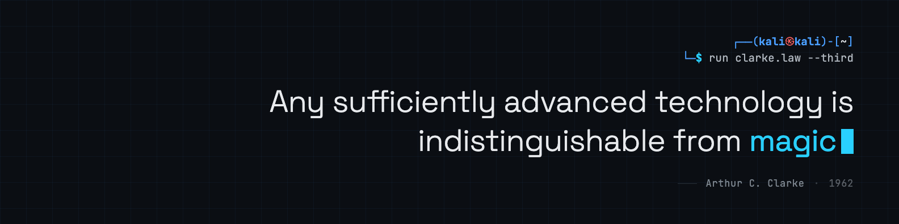

# Alan Vieira

- Software & AI Engineer.
- Studying Computer Science @ UNIT.
- Building technology to augment human intelligence.

**Stack:** Python · JavaScript · React · Express.js · MySQL

**Interests:** Software Development · UX/UI · ML/DS · AI Engineering

---

